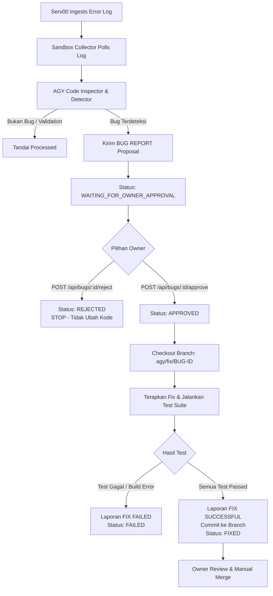

# 🤖 Sandbox AGY Bug Detection & Fix Agent

Service Sandbox yang bertindak sebagai **Analyst + Coder** cerdas untuk menganalisis log error dari Serv00, mengidentifikasi root cause pada repository kode, mengajukan proposal bug report terstruktur, dan melakukan perbaikan kode + verifikasi pengujian setelah mendapatkan **Owner Approval**.

---

## 🔒 Prinsip & Batasan Keamanan AGY

> [!IMPORTANT]
> **PRINSIP UTAMA:**
> 1. AGY **TIDAK BOLEH** mengubah kode di production secara langsung.
> 2. AGY **TIDAK BOLEH** melewati persetujuan Owner (`WAITING_FOR_OWNER_APPROVAL`).
> 3. Jika Owner menolak (`REJECTED`), AGY **STOP** dan tidak menyentuh kode.
> 4. Jika Owner menyetujui (`APPROVED`), AGY membuat branch terpisah: `agy/fix/<bug-id>`.
> 5. AGY menjalankan build & test suite. Jika test gagal (`FAILED`), status dicatat dan tidak dianggap selesai.
> 6. Jika semua test lulus (`FIXED`), AGY menghasilkan laporan `FIX SUCCESSFUL` dan **TIDAK** melakukan auto-merge. Keputusan merge tetap di tangan Owner.

---

## 📂 Struktur Direktori

```text
sandbox/
├── src/
│   ├── agy/
│   │   ├── fixRunner.ts      # Orchestrator eksekusi fix & status gate
│   │   ├── gitManager.ts     # Branch checkout (agy/fix/...), commit, diff
│   │   └── testRunner.ts     # Eksekutor test suite (Go / Node.js)
│   ├── analyzer/
│   │   ├── codeInspector.ts  # Pembaca context kode, stack trace locator, diff
│   │   ├── detector.ts       # Klasifikasi bug, severity, root cause
│   │   └── types.ts          # Analyzer interfaces
│   ├── approval/
│   │   ├── reporter.ts       # Format proposal BUG REPORT & kirim ke Serv00
│   │   └── watcher.ts        # Polling status approval Owner
│   ├── collector/
│   │   ├── client.ts         # REST API Client ke Serv00
│   │   ├── poller.ts         # Exponential backoff + jitter log poller
│   │   └── types.ts          # Remote log & bug interfaces
│   ├── reporter/
│   │   └── outcomeReporter.ts # Format laporan FIX SUCCESSFUL & FIX FAILED
│   ├── config.ts             # Sandbox env config
│   └── index.ts              # Sandbox daemon runner
├── tests/                    # Vitest unit & E2E integration test suite
├── .env.example
├── package.json
├── tsconfig.json
└── README.md
```

---

## 🔄 Alur Kerja Siklus (Lifecycle Workflow)



---

## ⚙️ Konfigurasi Environment (`.env`)

```bash
NODE_ENV=production
SERV00_API_URL=http://localhost:7095/api
SERV00_API_KEY=serv00_sandbox_secure_token_change_in_production
SERV00_OWNER_TOKEN=owner_secret_approval_token_change_in_production
TARGET_REPO_PATH=/project/sandbox/botgo
POLL_INTERVAL_MS=15000
MAX_POLL_BACKOFF_MS=60000
REQUIRE_OWNER_APPROVAL=true
```

---

## 🚀 Menjalankan Sandbox Daemon

```bash
cd sandbox
npm install
npm run build

# Menjalankan Daemon Collector & Analyzer
npm start
```

---

## 🧪 Menjalankan Pengujian Lengkap (E2E)
```bash
npm test
```
Menjalankan pengujian unit, code inspector, detector, dan simulasi siklus penuh end-to-end (ingestion → proposal → rejection gate → approval → branch checkout → test runner → outcome report).
